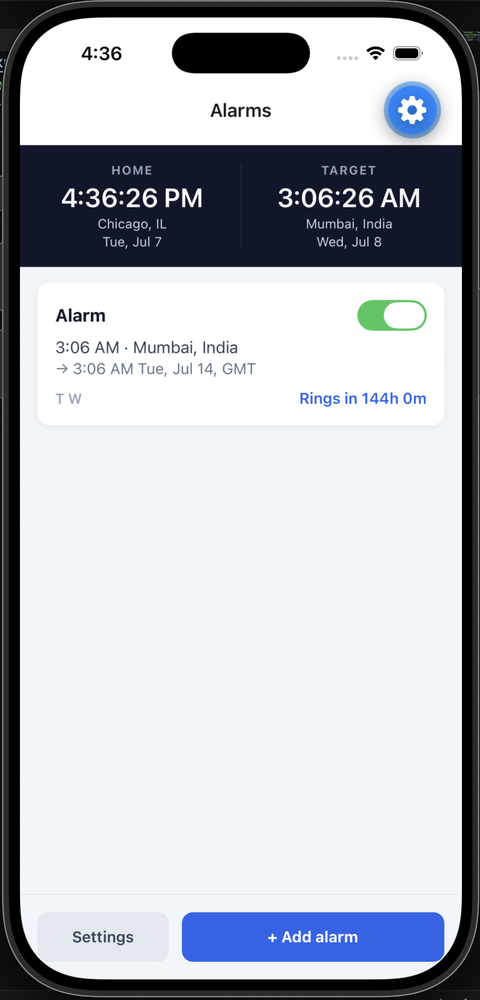
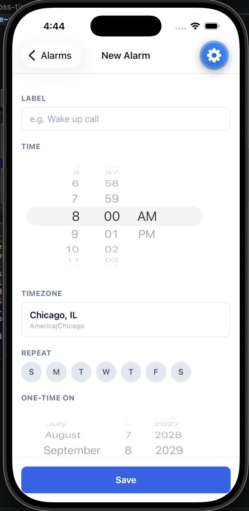
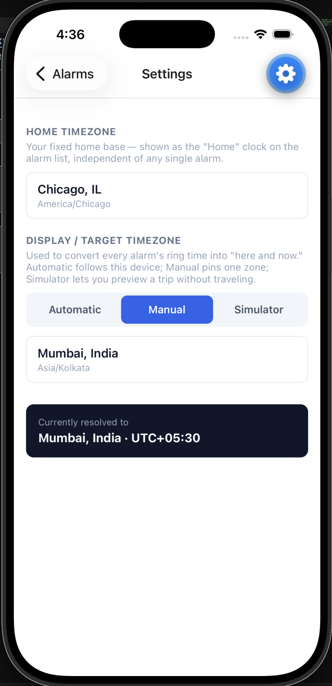

# cross-timezone-alarms

A mobile alarm clock for people who travel across time zones. Set an alarm
against *any* time zone, for example "6:00 PM in Dallas", and it rings at the correct
real-world instant no matter where your phone physically is, before or after
you travel. Fly to India and that same alarm rings at 4:30 AM local time,
automatically.

The golden rule the whole app is built around: **never store a local wall-clock
time.** The moment you hit Save, the intended local time is converted to an
absolute UTC instant using the alarm's source IANA time zone, and that
instant is what the app schedules and uses.

## Screenshots

| Alarm list | New alarm | Settings |
|---|---|---|
|  |  |  |

## Features

- **Set an alarm in any time zone:** search by city name (e.g. "Dallas",
  "Mumbai") rather than raw UTC offsets, with one-time or recurring
  (weekday) schedules.
- **DST-safe scheduling:** a recurring alarm's fire instant is recomputed
  per-occurrence against its source zone, so "6 PM Dallas" keeps firing at
  6 PM Dallas time across daylight-saving transitions, even though the UTC
  instant shifts by an hour.
- **Original intent + converted time + live countdown:** every alarm shows
  what you set ("6:00 PM · Dallas, TX"), what that means right now
  ("→ 4:30 AM tomorrow, UTC+05:30"), and a live "Rings in Xh Ym" countdown.
- **Home vs. Target dual clock:** a persistent header always shows your
  fixed "Home" time zone alongside the current "Target" (display) time
  zone, so you always know both at a glance.
- **Automatic / Manual / Simulator display mode:** Automatic follows the
  device's detected zone (updates automatically after real travel); Manual
  pins one zone; Simulator lets you preview a trip ("what will this look
  like once I land in Mumbai?") without actually traveling.
- **Real OS-scheduled notifications:** alarms fire via actual scheduled
  local notifications (`expo-notifications`), not just while the app is
  open in the foreground.
- **12-hour / 24-hour clock format:** a Settings toggle that applies
  everywhere a time is shown — alarm times, the Home/Target clocks, and
  countdowns.

## Tech stack

- [Expo](https://expo.dev) (React Native, managed workflow) + TypeScript
- [Luxon](https://moment.github.io/luxon/) for all IANA time zone / DST math
- [`city-timezones`](https://www.npmjs.com/package/city-timezones) for
  offline city → time zone search
- `@react-navigation/native-stack` for navigation
- `@react-native-async-storage/async-storage` for local persistence
- `expo-notifications` + `expo-task-manager` for real scheduled alarms
- Jest for testing the scheduling engine

## Getting started

Install dependencies (already done if you're working from this repo as-is):

```bash
npm install
```

Then run it. Pick whichever matches what you have available:

### On your phone (easiest, no simulator needed)

1. Install **Expo Go** from the App Store / Play Store.
2. Run:
   ```bash
   npm start
   ```
3. Scan the QR code shown in the terminal (iOS: Camera app; Android: Expo
   Go's built-in scanner). Phone and computer must be on the same Wi-Fi
   (use `npx expo start --tunnel` if not).

> Expo Go's App/Play Store build sometimes lags a few days behind the SDK
> version this project uses. If Expo Go refuses to open the project and
> says it needs an update but none is available yet, use the web preview
> below in the meantime, or build a dev client with `npx expo run:ios` /
> `npx expo run:android`.

### iOS Simulator (macOS + Xcode)

```bash
npm run ios
```

### Android Emulator (Android Studio)

```bash
npm run android
```

### Web preview (fastest to try, no real notifications)

```bash
npm run web
```

Everything works in the browser — timezone conversion, the countdown, the
Home/Target clocks, the Simulator travel-preview — except an alarm actually
*ringing*, since scheduled OS notifications are a native-only capability.

## Testing

The scheduling engine (the DST-aware "what UTC instant does this alarm fire
at" logic) is unit tested:

```bash
npm test
```

## Project structure

```
src/
  domain/        Alarm/Settings types, the scheduling engine, display-zone resolver
  data/          AsyncStorage repositories, bundled city/timezone dataset
  state/         React Context for alarms and settings
  notifications/ expo-notifications scheduling + background reconciliation
  screens/       Alarm List, Add/Edit Alarm, Timezone Picker, Settings
  components/    AlarmCard, DualClockHeader, CountdownText, etc.
  navigation/     React Navigation stack
__tests__/       Scheduling engine tests (DST boundaries, recurrence, edge cases)
```
